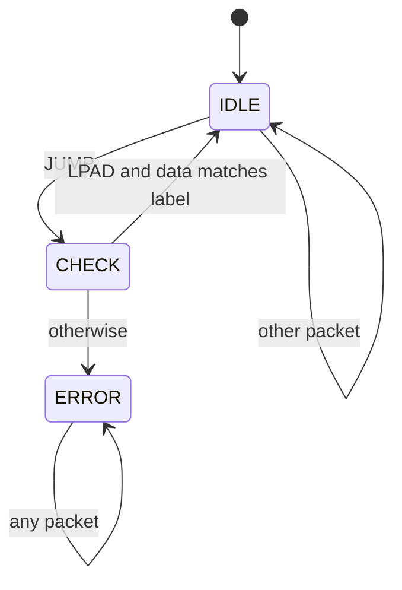

## Submission for [Implementation of RISC-V extensions for Control Flow Integrity](https://mentorship.lfx.linuxfoundation.org/project/846490b5-2092-4645-895a-83c147ba5b68) challenge.

## State machine

