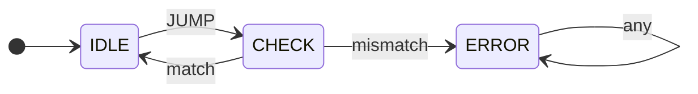

## Submission for [Implementation of RISC-V extensions for Control Flow Integrity](https://mentorship.lfx.linuxfoundation.org/project/846490b5-2092-4645-895a-83c147ba5b68) challenge.


## State machine


Packets other than `JUMP` leave the FSM in `IDLE`, including `SET`, which
updates the internal label. In `CHECK`, a matching `LPAD` returns to `IDLE`;
all other packets enter `ERROR`. The `ERROR` state is permanent until reset.

## Dependencies
The `cocotb` and `verilator` are needed to run the tests.

## How to run the tests
```bash
make
```
If you want to run the tests with Icarus verilog change the command to
```bash
make SIM=icarus
```
